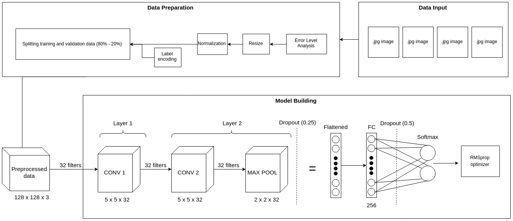

# Fake Image Detector

**Image Tampering Detection using ELA and CNN**

---

## Members
1. [Agus Gunawan](https://github.com/agusgun)
2. [Holy Lovenia](https://github.com/holylovenia)
3. [Adrian Hartanto Pramudita](https://github.com/adrianhp97)

## Indonesian paper/documentation
[Get it here!](https://github.com/agusgun/FakeImageDetector/blob/master/docs/Deteksi%20Pemalsuan%20Gambar%20dengan%20ELA%20dan%20Deep%20Learning.pdf)

## Project objective
Combine the implementation of error-level analysis (ELA) and deep learning to detect whether an image has undergone fabrication or/and editing process or not, e.g. splicing.

## Methods
1. Error-level analysis
2. Convolutional neural networks (CNN)

## Architecture

## Result
- Convergence: Epoch 9
- Best accuracy: 91.83% (epoch 9)
